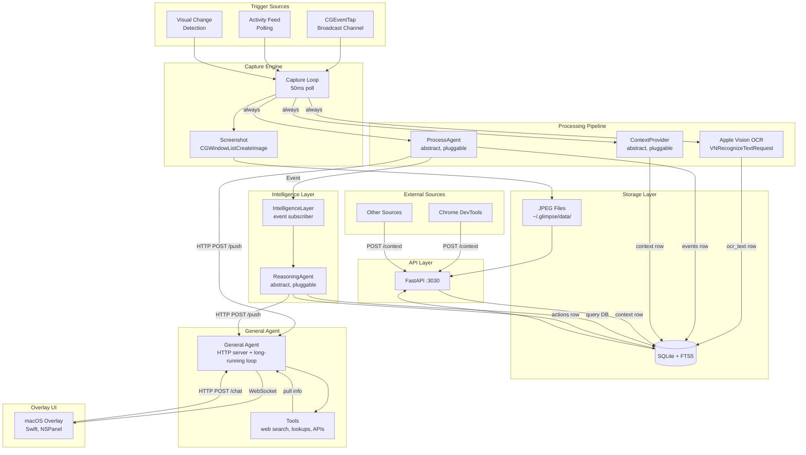
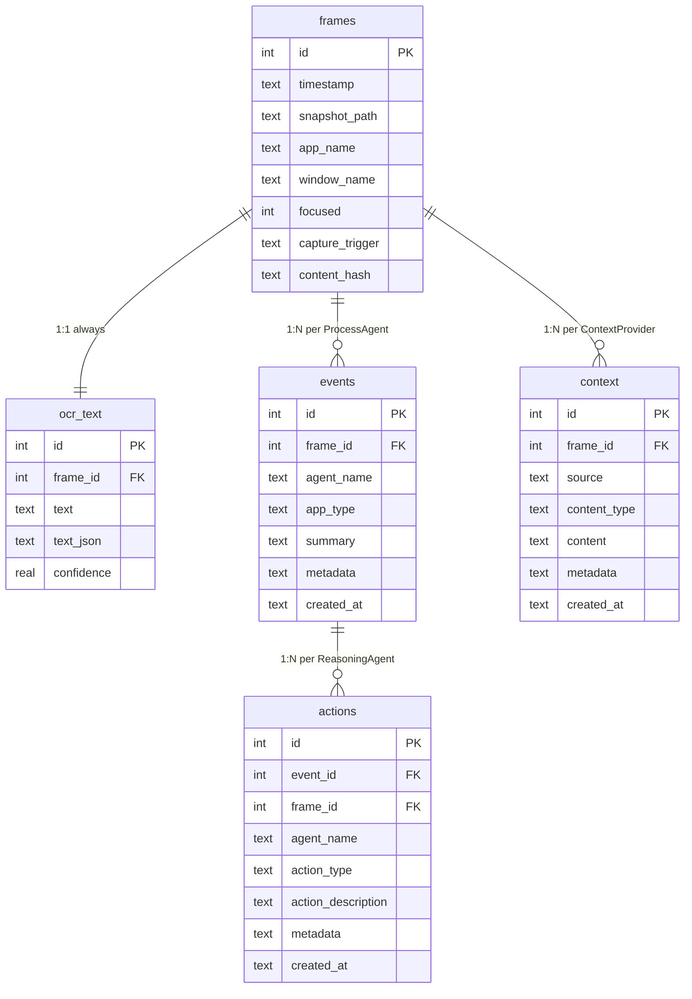
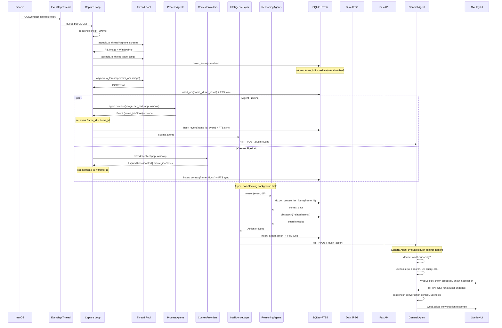

# Python Screenshot + OCR API Layer for macOS

Build everything under glimpse/src

## Architecture Overview

The system has five layers of data processing:

1. **OCR flow** -- always runs Apple Vision OCR to extract full text from screenshots
2. **Agent flow** -- feeds screenshots to registered `ProcessAgent` implementations that produce structured `Event` objects
3. **Context flow** -- collects `AdditionalContext` from registered `ContextProvider` implementations (e.g. Chrome DevTools, clipboard)
4. **Intelligence layer** -- downstream of the Agent flow; registered `ReasoningAgent` implementations receive Events, independently query the database for additional context, and produce `Action` objects
5. **General agent** -- a lightweight HTTP server and long-running conversational loop. Receives pushes from process agents (events) and the intelligence layer (actions) via HTTP. The user can talk to it directly — it maintains full session context across the conversation, uses tools mid-conversation to pull additional info (web search, lookups, API calls), decides what's worth surfacing, and pushes proposals/notifications to the overlay UI via WebSocket. It's not a stateless API — it's a persistent process with memory that the user dips in and out of

All data flows share `frame_id` in the database. The Intelligence Layer and General Agent operate asynchronously -- they do not block the capture loop.




## Project Structure

```
glimpse/
├── pyproject.toml
├── src/
│       ├── __init__.py
│       ├── main.py                 # Entry point, wires everything
│       ├── config.py               # Settings (intervals, thresholds, paths)
│       ├── capture/
│       │   ├── __init__.py
│       │   ├── screenshot.py       # CGWindowListCreateImage wrapper
│       │   ├── triggers.py         # CaptureTrigger enum + event-driven loop
│       │   ├── event_tap.py        # CGEventTap (broadcast channel)
│       │   ├── activity_feed.py    # Typing/idle detection (polling)
│       │   └── frame_compare.py    # Histogram diff (visual change)
│       ├── ocr/
│       │   ├── __init__.py
│       │   └── apple_vision.py     # VNRecognizeTextRequest via pyobjc
│       ├── process/
│       │   ├── __init__.py
│       │   └── process_agent.py    # Abstract ProcessAgent base class
│       ├── context/
│       │   ├── __init__.py
│       │   └── context_provider.py # Abstract ContextProvider base class
│       ├── intelligence/
│       │   ├── __init__.py
│       │   ├── reasoning_agent.py  # Abstract ReasoningAgent base class
│       │   └── intelligence_layer.py # Event subscriber, dispatches to ReasoningAgents
│       ├── general_agent/
│       │   ├── __init__.py
│       │   ├── agent.py            # Core agent loop — queue consumer, conversation state, tool dispatch, overlay WS push
│       │   ├── server.py           # FastAPI router mounted at /agent/* (push, chat, status) on main API server
│       │   └── tools.py            # Tool registry — db_query, db_raw_sql, web_search (stub), price_lookup (stub), contact_lookup
│       ├── storage/
│       │   ├── __init__.py
│       │   ├── database.py         # SQLite + FTS5 manager
│       │   ├── models.py           # All dataclasses: Frame, OCRResult, Event, AdditionalContext, Action
│       │   └── snapshot_writer.py  # JPEG writer to ~/.glimpse/data/
│       └── api/
│           ├── __init__.py
│           ├── server.py           # FastAPI app
│           └── routes/
│               ├── __init__.py
│               ├── search.py       # GET /search
│               ├── frames.py       # GET /frames/{id}
│               ├── events.py       # GET /events
│               ├── context.py      # GET /context, POST /context
│               ├── actions.py      # GET /actions
│               ├── raw_sql.py      # POST /raw_sql
│               └── health.py       # GET /health
```

---

## Module-by-Module Design

### 1. Trigger System (`capture/triggers.py`)

Port screenpipe's `CaptureTrigger` enum and the 50ms event-driven capture loop.

**CaptureTrigger enum:**

```python
class CaptureTrigger(str, Enum):
    APP_SWITCH = "app_switch"
    WINDOW_FOCUS = "window_focus"
    CLICK = "click"
    TYPING_PAUSE = "typing_pause"
    CLIPBOARD = "clipboard"
    VISUAL_CHANGE = "visual_change"
    IDLE = "idle"
    MANUAL = "manual"
```

**Capture loop** runs in an `asyncio` task, polling every 50ms:

1. Check `asyncio.Queue` for broadcast triggers (from event tap)
2. Call `activity_feed.poll()` for typing pause / idle
3. If no trigger yet and 3s since last visual check: capture frame, compare histogram, emit `VISUAL_CHANGE` if diff > 0.05
4. If trigger found and debounce passed (200ms min): run `do_capture()`

**Threading model for blocking calls:** The capture loop is an `asyncio` task, but several operations it invokes are blocking (CPU-bound or synchronous C calls). These **must** be dispatched via `asyncio.to_thread()` to avoid blocking the event loop (which would stall FastAPI and the IntelligenceLayer):

- `capture_screen()` -- `CGWindowListCreateImage` is a synchronous CoreGraphics call (~5-20ms)
- `perform_ocr(image)` -- `VNImageRequestHandler.performRequests_error_` is synchronous (~50-200ms)
- `frame_compare.compare()` -- PIL resize + numpy histogram (~1-5ms, less critical but still blocking)
- `snapshot_writer.save()` -- JPEG encoding + disk I/O

Example pattern inside `do_capture()`:

```python
image, window_info = await asyncio.to_thread(capture_screen)
ocr_result = await asyncio.to_thread(perform_ocr, image)
```

**Key constants** (from screenpipe defaults):

- `MIN_CAPTURE_INTERVAL_MS = 200`
- `IDLE_CAPTURE_INTERVAL_MS = 30_000`
- `TYPING_PAUSE_DELAY_MS = 500`
- `VISUAL_CHECK_INTERVAL_MS = 3_000`
- `VISUAL_CHANGE_THRESHOLD = 0.05`
- `POLL_INTERVAL_MS = 50`
- `CAPTURE_TIMEOUT_S = 15`

### 2. Broadcast Channel — CGEventTap (`capture/event_tap.py`)

Uses `pyobjc` Quartz framework to install a passive event tap on a background thread.

**Event mask** (matching screenpipe):

- `kCGEventLeftMouseDown`, `kCGEventRightMouseDown` (clicks)
- `kCGEventKeyDown`, `kCGEventKeyUp` (typing detection)
- `kCGEventScrollWheel` (activity tracking)
- `kCGEventMouseMoved` (activity tracking)

**Callback** classifies events and pushes `CaptureTrigger` items onto the shared `asyncio.Queue`:

- Mouse down -> `CaptureTrigger.CLICK`
- Cmd+C / Cmd+X / Cmd+V -> `CaptureTrigger.CLIPBOARD`
- Key events -> feed into `ActivityFeed` (no direct trigger; typing pause handled by polling)

**App switch / window focus** detection via `NSWorkspace.sharedWorkspace().notificationCenter()` observers:

- `NSWorkspaceDidActivateApplicationNotification` -> `CaptureTrigger.APP_SWITCH`
- Window title change (poll focused window via AX) -> `CaptureTrigger.WINDOW_FOCUS`

Implementation: run `CFRunLoop` on a dedicated `threading.Thread` (CGEventTap requires a run loop). Bridge to async via `loop.call_soon_threadsafe(queue.put_nowait, trigger)`.

**pyobjc imports**: `Quartz.CGEventTapCreate`, `Quartz.CGEventMaskBit`, `AppKit.NSWorkspace`, `ApplicationServices` for AX.

### 3. Activity Feed Polling (`capture/activity_feed.py`)

Port of screenpipe's `ActivityFeed` -- tracks input timestamps (not content).

**State**: `last_activity_ms`, `last_keyboard_ms`, `keyboard_count`, `was_typing`, `last_capture` (all `time.monotonic()` based).

`**record(kind: ActivityKind)`** called from the event tap callback thread (thread-safe via `threading.Lock`).

`**poll() -> Optional[CaptureTrigger]`** called every 50ms from capture loop:

- If `was_typing` and `keyboard_idle >= 500ms` and `not is_typing()` -> `TYPING_PAUSE`
- If `is_typing()` (keyboard idle < 300ms) -> set `was_typing = True`
- If `time_since_last_capture >= 30s` -> `IDLE`

### 4. Visual Change Detection (`capture/frame_compare.py`)

Port of screenpipe's `FrameComparer`.

**Algorithm:**

1. Downscale image 4x using `Pillow` (`Image.resize` with `NEAREST`)
2. Hash raw bytes (`hashlib.md5` or Python's `hash`)
3. If hash matches previous -> return 0.0 (no change)
4. Convert both frames to grayscale, compute histograms (`numpy.histogram`, 256 bins)
5. Normalize histograms, compute **Hellinger distance**: `sqrt(1 - sum(sqrt(h1 * h2)))`
6. Return distance (0.0 = identical, 1.0 = completely different)

If distance > 0.05 -> emit `CaptureTrigger.VISUAL_CHANGE`.

**Dependencies**: `Pillow`, `numpy`.

### 5. Screenshot Capture (`capture/screenshot.py`)

Uses CoreGraphics via pyobjc:

```python
from Quartz import (
    CGWindowListCreateImage, CGRectInfinite,
    kCGWindowListOptionOnScreenOnly,
    kCGWindowImageDefault,
    CGWindowListCopyWindowInfo,
    kCGWindowListOptionAll, kCGNullWindowID
)
```

`**capture_screen(monitor_id: int = 0) -> PIL.Image**`: `CGWindowListCreateImage` -> `NSBitmapImageRep` -> raw bytes -> `PIL.Image`.

`**get_window_info() -> list[WindowInfo]**`: `CGWindowListCopyWindowInfo` to get app name, window title, bounds, PID, on-screen status for all visible windows.

`**get_focused_app() -> tuple[str, str]**`: Use `NSWorkspace.sharedWorkspace().frontmostApplication()` for app name + PID, then AX for window title.

### 6. Apple Vision OCR (`ocr/apple_vision.py`)

Uses pyobjc Vision framework, matching screenpipe's approach:

```python
from Vision import VNRecognizeTextRequest, VNImageRequestHandler
from Quartz import CGImageGetWidth, CGImageGetHeight
```

`**perform_ocr(image: PIL.Image) -> OCRResult**`:

1. Convert PIL Image to grayscale
2. Create `CGImage` from raw bytes (via `CGDataProviderCreateWithData` + `CGImageCreate`)
3. Create `VNImageRequestHandler` with the CGImage
4. Create `VNRecognizeTextRequest`, set languages, disable language correction
5. `handler.performRequests_error_([request], None)`
6. Extract results: text, confidence, bounding boxes (convert from bottom-left to top-left origin)
7. Return `OCRResult(text, text_json, confidence)`

### 7. Models (`storage/models.py`)

Canonical location for all data transfer dataclasses. Every module that needs `Event`, `AdditionalContext`, `Action`, etc. imports from here, avoiding circular dependencies.

```python
from dataclasses import dataclass, field


@dataclass
class Frame:
    id: int | None = None
    timestamp: str = ""
    snapshot_path: str | None = None
    app_name: str | None = None
    window_name: str | None = None
    focused: bool = True
    capture_trigger: str = ""
    content_hash: str | None = None


@dataclass
class OCRResult:
    text: str = ""
    text_json: str = ""               # JSON array with positions + confidence per line
    confidence: float = 0.0


@dataclass
class Event:
    frame_id: int | None = None       # set by capture loop after frame insert
    agent_name: str = ""
    app_type: str = ""                # e.g. "browser", "ide", "terminal", "chat", "email"
    summary: str = ""
    metadata: dict = field(default_factory=dict)
    id: int | None = None             # set after DB insert


@dataclass
class AdditionalContext:
    frame_id: int | None = None       # None when pushed via API independently, or before capture loop fills it in
    source: str = ""                  # provider name, e.g. "chrome_devtools", "clipboard", "git"
    content_type: str = ""            # e.g. "dom", "console_log", "network"
    content: str = ""
    metadata: dict = field(default_factory=dict)


@dataclass
class Action:
    event_id: int | None = None       # links to events.id that triggered this
    frame_id: int | None = None       # links to frames.id (denormalized from event)
    agent_name: str = ""
    action_type: str = ""             # e.g. "notify", "log", "flag", "summarize", "escalate"
    action_description: str = ""
    metadata: dict = field(default_factory=dict)
```

All IDs and foreign keys default to `None` and are filled in by the capture loop or the database layer after insertion. This allows agents and providers to construct partial objects without needing the `frame_id` at creation time.

### 8. ProcessAgent (`process/process_agent.py`)

Abstract base class that takes a screenshot and produces structured `Event` objects. Multiple agents can be registered and run in parallel on each capture. The `Event` dataclass is defined in `storage/models.py` and imported here.

```python
from abc import ABC, abstractmethod
from PIL import Image
from glimpse.storage.models import Event


class ProcessAgent(ABC):
    @property
    @abstractmethod
    def name(self) -> str:
        """Unique identifier for this agent."""
        ...

    @abstractmethod
    async def process(self, image: Image.Image, ocr_text: str,
                      app_name: str | None, window_name: str | None) -> Event | None:
        """Analyze a screenshot and return an Event, or None to skip."""
        ...
```

**Design points:**

- `process()` receives the PIL image, the OCR text (already extracted), and window context so agents can use any combination
- Returns `Event` with `frame_id=None` -- the capture loop fills in `frame_id` after the frame is inserted into the database (same pattern as `AdditionalContext`)
- Returns `None` if the agent decides the frame is not worth producing an event for (e.g. idle screen, duplicate content)
- Agents are registered in `main.py` via a list; the capture loop iterates and dispatches to all of them
- Agents run via `asyncio.gather()` so multiple agents process the same frame concurrently
- The `metadata` dict allows agent-specific fields without schema changes (stored as JSON in DB)

**Included default: `NoOpAgent`** -- a trivial implementation that always returns `None`, useful as a template and for testing the pipeline without any real agent logic.

Users extend `ProcessAgent` to build custom agents (e.g. an LLM-based summarizer, a rule-based app classifier, a meeting detector). Registration:

```python
# main.py
from glimpse.process.process_agent import ProcessAgent

agents: list[ProcessAgent] = [
    MyCustomAgent(),
    AnotherAgent(),
]
```

### 9. ContextProvider (`context/context_provider.py`)

Abstract base class for collecting additional context from external sources at capture time. Unlike ProcessAgent (which analyzes the screenshot), ContextProvider reaches out to external systems to gather supplementary data tied to the same moment. The `AdditionalContext` dataclass is defined in `storage/models.py` and imported here.

```python
from abc import ABC, abstractmethod
from glimpse.storage.models import AdditionalContext


class ContextProvider(ABC):
    @property
    @abstractmethod
    def name(self) -> str:
        """Unique identifier for this provider (used as `source` in DB)."""
        ...

    @abstractmethod
    async def collect(self, app_name: str | None,
                      window_name: str | None) -> list[AdditionalContext]:
        """Collect context for the current capture. Return empty list to skip."""
        ...
```

**Design points:**

- `collect()` receives the current app/window context so providers can decide whether to activate (e.g. Chrome DevTools provider only runs when `app_name` contains "Chrome" or "Chromium")
- Returns a **list** because a single provider may produce multiple context items (e.g. DevTools might return DOM snapshot + console logs + network requests as separate rows)
- `frame_id` is set by the capture loop after the frame is inserted -- providers return `AdditionalContext` with `frame_id=None` and the loop fills it in
- Providers run concurrently via `asyncio.gather()` alongside ProcessAgents after OCR completes
- `content_type` is a free-form string allowing each provider to tag its output (queryable via API)

**Push path (POST /context):** External tools that cannot be called synchronously during capture (e.g. a Chrome extension, a separate DevTools bridge process) can push context independently via the REST API:

```
POST /context
{
    "frame_id": 42,         // optional -- if null, attaches to most recent frame
    "source": "chrome_devtools",
    "content_type": "dom",
    "content": "<html>...</html>",
    "metadata": {"url": "https://example.com", "tab_id": 3}
}
```

**Example providers:**

- `ChromeDevToolsProvider` -- connects to Chrome's remote debugging port (localhost:9222), captures DOM, console, or network data via CDP
- `ClipboardProvider` -- reads current clipboard contents at capture time
- `GitContextProvider` -- captures current branch/diff for IDE windows

### 10. ReasoningAgent and Action (`intelligence/reasoning_agent.py`)

Abstract base class for agents that reason over Events produced by ProcessAgents. Unlike ProcessAgents (which analyze raw screenshots), ReasoningAgents operate at a higher semantic level -- they receive structured Events and can independently query the database for additional context before deciding on an Action. Both `Event` and `Action` dataclasses are defined in `storage/models.py` and imported here.

```python
from abc import ABC, abstractmethod
from glimpse.storage.models import Event, Action
from glimpse.storage.database import DatabaseManager


class ReasoningAgent(ABC):
    @property
    @abstractmethod
    def name(self) -> str:
        """Unique identifier for this reasoning agent."""
        ...

    @abstractmethod
    async def reason(self, event: Event, db: DatabaseManager) -> Action | None:
        """
        Given an Event, optionally query the database for more context,
        and return an Action or None to skip.
        """
        ...
```

This gives each ReasoningAgent full read access to all stored data (OCR, events, context, frames) via the `DatabaseManager`, without the overhead and failure modes of HTTP self-calls.

**Design points:**

- `reason()` receives the `Event` that triggered it plus a `DatabaseManager` for direct data access
- A ReasoningAgent can fetch OCR text from related frames, query context entries, search for patterns across time, etc. -- whatever reasoning it needs
- Returns `None` if no action is warranted (e.g. the event is not interesting enough)
- `Action` is deliberately minimal (`action_type` + `action_description`) -- it is an **interface for downstream systems** to consume, not an execution engine
- `metadata` dict allows agent-specific structured data (stored as JSON in DB)

### 11. IntelligenceLayer (`intelligence/intelligence_layer.py`)

Orchestrator that subscribes to new Events from the capture loop and dispatches them to registered ReasoningAgents.

```python
import logging

logger = logging.getLogger(__name__)


class IntelligenceLayer:
    def __init__(self, agents: list[ReasoningAgent],
                 db: DatabaseManager):
        self._agents = agents
        self._db = db
        self._event_queue: asyncio.Queue[Event] = asyncio.Queue()

    async def submit(self, event: Event) -> None:
        """Called by capture loop after an Event is stored."""
        await self._event_queue.put(event)

    async def run(self) -> None:
        """Background loop: dequeue events, dispatch to reasoning agents."""
        while True:
            event = await self._event_queue.get()
            results = await asyncio.gather(
                *(agent.reason(event, self._db) for agent in self._agents),
                return_exceptions=True,
            )
            for i, result in enumerate(results):
                if isinstance(result, BaseException):
                    logger.error("ReasoningAgent %s failed: %s",
                                 self._agents[i].name, result, exc_info=result)
                elif isinstance(result, Action):
                    await self._db.insert_action(result)
```

**Design points:**

- Runs as a separate `asyncio.Task` -- does **not** block the capture loop
- The capture loop calls `intelligence_layer.submit(event)` after storing an Event in the DB
- Multiple ReasoningAgents process each Event concurrently via `asyncio.gather()`
- Exceptions from individual agents are caught and **logged** (via `return_exceptions=True` + explicit error logging), never crash the layer
- Actions are stored in the database and exposed via the API
- The queue provides natural backpressure -- if reasoning is slow, events queue up but capture continues unaffected

**Relationship to the capture loop:**

```
Capture Loop (do_capture)
  └── OCR (via asyncio.to_thread)
  └── ProcessAgent.process() → Event
       ├── DB: insert_event(frame_id, event)
       └── IntelligenceLayer.submit(event)  ← fire-and-forget
                │
                ▼  (async, non-blocking)
       IntelligenceLayer.run() background task
         └── ReasoningAgent.reason(event, db)
              ├── db.get_context_for_frame(frame_id)
              ├── db.search("related query")
              └── returns Action or None
                   └── DB: insert_action(action)
```

### 12. Storage (`storage/database.py`)

SQLite with FTS5 and WAL mode. Five core tables: `frames` (capture metadata), `ocr_text` (extracted text linked to frame), `events` (agent-produced structured data linked to frame), `context` (additional context from external sources linked to frame), and `actions` (reasoning agent output linked to events).

**Tables:**

```sql
-- Core capture record (one row per screenshot)
CREATE TABLE frames (
    id INTEGER PRIMARY KEY AUTOINCREMENT,
    timestamp TEXT NOT NULL,
    snapshot_path TEXT,
    app_name TEXT,
    window_name TEXT,
    focused INTEGER DEFAULT 1,
    capture_trigger TEXT,
    content_hash TEXT
);

-- OCR output (one row per frame, always populated)
CREATE TABLE ocr_text (
    id INTEGER PRIMARY KEY AUTOINCREMENT,
    frame_id INTEGER NOT NULL REFERENCES frames(id),
    text TEXT,
    text_json TEXT,       -- JSON array with positions + confidence per line
    confidence REAL
);

-- Agent-produced events (0..N rows per frame, one per ProcessAgent)
CREATE TABLE events (
    id INTEGER PRIMARY KEY AUTOINCREMENT,
    frame_id INTEGER NOT NULL REFERENCES frames(id),
    agent_name TEXT NOT NULL,
    app_type TEXT NOT NULL,
    summary TEXT NOT NULL,
    metadata TEXT,         -- JSON blob for agent-specific fields
    created_at TEXT NOT NULL
);

-- Additional context from external sources (0..N per frame, one+ per ContextProvider)
CREATE TABLE context (
    id INTEGER PRIMARY KEY AUTOINCREMENT,
    frame_id INTEGER REFERENCES frames(id),  -- nullable for independently pushed context
    source TEXT NOT NULL,                     -- provider name, e.g. "chrome_devtools"
    content_type TEXT NOT NULL,               -- e.g. "dom", "console_log", "network"
    content TEXT NOT NULL,
    metadata TEXT,                            -- JSON blob for source-specific fields
    created_at TEXT NOT NULL
);

-- Actions produced by ReasoningAgents (0..N per event)
CREATE TABLE actions (
    id INTEGER PRIMARY KEY AUTOINCREMENT,
    event_id INTEGER NOT NULL REFERENCES events(id),
    frame_id INTEGER NOT NULL REFERENCES frames(id),
    agent_name TEXT NOT NULL,
    action_type TEXT NOT NULL,
    action_description TEXT NOT NULL,
    metadata TEXT,                     -- JSON blob for agent-specific fields
    created_at TEXT NOT NULL
);

-- FTS5 index on OCR text + frame metadata for search
-- content='' (contentless): FTS stores its own copy, but inserts/deletes
-- must be done manually alongside the source tables via triggers.
CREATE VIRTUAL TABLE ocr_fts USING fts5(
    text, app_name, window_name,
    content='',
    tokenize='unicode61'
);

CREATE VIRTUAL TABLE events_fts USING fts5(
    summary, app_type, agent_name,
    content='',
    tokenize='unicode61'
);

CREATE VIRTUAL TABLE context_fts USING fts5(
    content, source, content_type,
    content='',
    tokenize='unicode61'
);

CREATE VIRTUAL TABLE actions_fts USING fts5(
    action_description, action_type, agent_name,
    content='',
    tokenize='unicode61'
);
```

**Relationship diagram:**




`**DatabaseManager**` class:

**Initialization:**

- On startup, set `PRAGMA journal_mode=WAL` for concurrent reader/writer access without blocking
- Set `PRAGMA foreign_keys=ON` for referential integrity
- Run schema migrations (CREATE TABLE IF NOT EXISTS)
- Connection pool: one writer (serialized via `asyncio.Lock`), multiple readers

**Write methods:**

- `insert_frame(...)` -> **synchronous** (not batched), returns `frame_id` immediately. The capture loop needs `frame_id` right away for subsequent `insert_ocr`, `insert_event`, `insert_context` calls within the same `do_capture()`.
- `insert_ocr(frame_id, ocr_result)` -> inserts into `ocr_text` **and** `ocr_fts`. Because `ocr_fts` indexes `app_name` and `window_name` (which live in `frames`, not `ocr_text`), the insert joins with `frames` to populate those FTS columns.
- `insert_event(frame_id, event)` -> inserts into `events` **and** `events_fts`. Returns `event_id`.
- `insert_context(frame_id, ctx)` -> inserts into `context` **and** `context_fts`. Also used by POST /context.
- `insert_action(action)` -> inserts into `actions` **and** `actions_fts`. Called by IntelligenceLayer.

**FTS synchronization:** Every insert method that writes to a core table also writes to the corresponding `_fts` table in the same transaction. Since the FTS tables use `content=''` (contentless mode), there are no automatic triggers -- the `DatabaseManager` is responsible for manual FTS inserts. Example for OCR:

```python
async def insert_ocr(self, frame_id: int, ocr: OCRResult) -> int:
    async with self._write_lock:
        row_id = await self._db.execute_insert(
            "INSERT INTO ocr_text (frame_id, text, text_json, confidence) VALUES (?, ?, ?, ?)",
            (frame_id, ocr.text, ocr.text_json, ocr.confidence),
        )
        frame = await self._db.execute_fetchone(
            "SELECT app_name, window_name FROM frames WHERE id = ?", (frame_id,)
        )
        await self._db.execute(
            "INSERT INTO ocr_fts (rowid, text, app_name, window_name) VALUES (?, ?, ?, ?)",
            (row_id, ocr.text, frame["app_name"], frame["window_name"]),
        )
        return row_id
```

**Read methods:**

- `search(query, limit, start_time, end_time, app_name)` -> FTS5 MATCH on `ocr_fts`, joined with `frames` and `ocr_text` for full results
- `search_events(query, app_type, agent_name, limit, start_time, end_time)` -> FTS5 MATCH on `events_fts`
- `search_context(query, source, content_type, limit, start_time, end_time)` -> FTS5 MATCH on `context_fts`
- `search_actions(query, action_type, agent_name, limit, start_time, end_time)` -> FTS5 MATCH on `actions_fts`
- `get_frame(id)` -> frame metadata + OCR + related events + related context + related actions
- `get_events_for_frame(frame_id)` -> all events for a given frame
- `get_context_for_frame(frame_id)` -> all context for a given frame
- `get_actions_for_event(event_id)` -> all actions produced from a given event
- `get_actions_for_frame(frame_id)` -> all actions linked to a given frame

### 13. REST API (`api/server.py`)

FastAPI application on `localhost:3030`.

**Endpoints:**


| Method | Path                    | Purpose                                                                                                      |
| ------ | ----------------------- | ------------------------------------------------------------------------------------------------------------ |
| GET    | `/search`               | FTS5 search across OCR text. Params: `q`, `app_name`, `limit`, `start_time`, `end_time`                      |
| GET    | `/frames/{id}`          | Return JPEG bytes for a frame                                                                                |
| GET    | `/frames/{id}/metadata` | Return frame metadata + OCR + events + context + actions                                                     |
| GET    | `/events`               | Search/list agent events. Params: `q`, `app_type`, `agent_name`, `limit`, `start_time`, `end_time`           |
| GET    | `/events/{frame_id}`    | All events for a specific frame                                                                              |
| GET    | `/context`              | Search/list context. Params: `q`, `source`, `content_type`, `limit`, `start_time`, `end_time`                |
| GET    | `/context/{frame_id}`   | All context entries for a specific frame                                                                     |
| POST   | `/context`              | Push context from external sources. Body: `source`, `content_type`, `content`, optional `frame_id`           |
| GET    | `/actions`              | Search/list actions. Params: `q`, `action_type`, `agent_name`, `event_id`, `limit`, `start_time`, `end_time` |
| GET    | `/actions/{event_id}`   | All actions produced from a specific event                                                                   |
| GET    | `/health`               | System health (uptime, frame/event/action counts, capture + intelligence status)                             |
| POST   | `/raw_sql`              | Execute read-only SQL query (SELECT only, LIMIT enforced)                                                    |


**Response schemas:**

```python
class OCRSearchResult(BaseModel):
    frame_id: int
    text: str
    app_name: str | None
    window_name: str | None
    timestamp: str
    capture_trigger: str
    confidence: float | None
    snapshot_path: str | None

class EventResult(BaseModel):
    event_id: int
    frame_id: int
    agent_name: str
    app_type: str
    summary: str
    metadata: dict | None
    created_at: str
    timestamp: str           # denormalized from frames
    app_name: str | None
    window_name: str | None

class ContextResult(BaseModel):
    context_id: int
    frame_id: int | None
    source: str
    content_type: str
    content: str
    metadata: dict | None
    created_at: str
    timestamp: str | None    # denormalized from frames (None if no frame_id)
    app_name: str | None
    window_name: str | None

class ActionResult(BaseModel):
    action_id: int
    event_id: int
    frame_id: int
    agent_name: str
    action_type: str
    action_description: str
    metadata: dict | None
    created_at: str
    event_summary: str       # denormalized from events
    event_app_type: str
    timestamp: str           # denormalized from frames
    app_name: str | None
    window_name: str | None

class FrameDetail(BaseModel):
    frame_id: int
    timestamp: str
    app_name: str | None
    window_name: str | None
    capture_trigger: str
    snapshot_path: str | None
    ocr: OCRSearchResult
    events: list[EventResult]
    context: list[ContextResult]
    actions: list[ActionResult]
```

### 14. Entry Point (`main.py`)

Wires all components and manages lifecycle:

1. Initialize `DatabaseManager` (run migrations, enable WAL mode)
2. Register `ProcessAgent` instances
3. Register `ContextProvider` instances
4. Register `ReasoningAgent` instances
5. Create `ToolRegistry` and `GeneralAgent` (with DB, tool registry, overlay WS URL)
6. Create `IntelligenceLayer` (with reasoning agents, DB, general agent)
7. Start FastAPI via `uvicorn` (in-process, same event loop) -- single server on port 3030, general agent routes mounted at `/agent/*`
8. Start `EventTap` on background thread (CGEventTap + NSWorkspace observers)
9. Start `ActivityFeed` (shared with event tap)
10. Start capture loop as `asyncio.Task` (with process agents + context providers + intelligence layer + general agent)
11. Start `IntelligenceLayer.run()` as background `asyncio.Task` -- pushes actions to the general agent via direct method calls
12. Start `GeneralAgent.run()` as background `asyncio.Task` -- the long-running conversational loop
13. Signal handling for graceful shutdown

CLI via `argparse`:

```
glimpse [--port 3030] [--data-dir ~/.glimpse] [--jpeg-quality 80] [--overlay-ws-url ws://localhost:9321]
```

### 15. General Agent (`general_agent/`)

The general agent is an in-process long-running loop that sits at the end of the pipeline. It's the brain — everything else feeds into it, and it decides what reaches the user. Its HTTP routes are mounted on the main FastAPI server at `/agent/*` (no separate port).

**`server.py`** -- FastAPI router (mounted at `/agent`):

- `POST /agent/push` -- receives events from process agents and actions from the intelligence layer. Payload: `{"type": "event"|"action", "data": {...}}`. Drops the item into the agent's async processing queue. Returns 202 immediately. Also receives pushes via direct method calls from the capture loop and intelligence layer (in-process, no HTTP overhead)
- `POST /agent/chat` -- user sends a message. The agent responds within the ongoing conversation context
- `GET /agent/status` -- health check, queue depth, current conversation state

**`agent.py`** -- the core loop (`GeneralAgent` class):

The agent runs as a continuous `asyncio.Task`:

1. Consumes items from the processing queue (events and actions pushed via direct method calls or `/agent/push`)
2. For each item, evaluates importance (actions score higher, certain action_types like "flag"/"escalate" boost score further)
3. Deduplicates — skips items with identical summaries within a 30s window
4. For high-importance items, calls tools to gather more info (DB queries for related history, web search stubs)
5. Formulates a notification and pushes to the overlay UI via WebSocket (`ws://localhost:9321`)

When the user talks to it (via `/agent/chat`):
- The conversation has full context — recent screen events (sliding window of 50), recent conversation history (30 turns)
- The agent uses tools mid-conversation (keyword-based intent detection → tool dispatch)
- It's a continuous session, not request-response — the user dips in and out, the agent keeps running

**`tools.py`** -- tool registry (`ToolRegistry` class):

Pluggable tools the agent can invoke during reasoning. Each tool is an async callable with a name, description, and parameter spec. Current set:

- `db_query` -- FTS search across Glimpse tables (ocr, events, context, actions)
- `db_raw_sql` -- raw SELECT queries against the database
- `web_search` -- stub, ready to wire to SerpAPI/Brave Search
- `price_lookup` -- stub, ready to wire to price comparison APIs
- `contact_lookup` -- searches OCR text and events for mentions of a person

**What the general agent is NOT:**
- Not a stateless API -- it maintains a running context/session
- Not a batch processor -- it responds in real-time to pushes and user input
- Not the vision model -- it doesn't look at the screen directly, it receives processed events from process agents
- Not a separate server -- runs in-process, routes on the main FastAPI port

---

## Data Flow (end-to-end)




**Note on ordering:**

1. Screenshot capture and OCR run via `asyncio.to_thread()` to avoid blocking the event loop
2. ProcessAgents + ContextProviders run concurrently after OCR; both return objects with `frame_id=None` which the capture loop fills in
3. Events are submitted to IntelligenceLayer via fire-and-forget `submit()`, and also pushed to the General Agent via HTTP
4. IntelligenceLayer runs as a separate background task -- ReasoningAgents process events asynchronously, querying the database directly, and never block the capture loop. Produced actions are pushed to the General Agent
5. The General Agent processes pushes from its queue, uses tools to gather additional info, and decides what to surface to the user via the overlay
6. External sources can push context at any time via `POST /context`
7. All DB insert methods also write to the corresponding FTS5 index in the same transaction

---

## Data Retention

With captures firing every 200ms-30s, storage grows unboundedly without a retention strategy. At moderate activity (~1 capture/sec), daily growth is approximately:

- **JPEG files**: ~50-200KB each -> 5-15 GB/day
- **SQLite**: OCR text + events + context + actions -> 200-500 MB/day

**Retention strategy (implemented in `DatabaseManager`):**

- `**MAX_RETENTION_DAYS`** (default: 7) -- frames, OCR, events, context, and actions older than this are deleted
- `**MAX_DB_SIZE_MB`** (default: 10_000) -- if the database exceeds this size, the oldest frames are pruned until under limit
- **Cleanup task**: runs as a periodic `asyncio.Task` (every 1 hour), deleting expired rows from all tables + their FTS entries, then removing orphaned JPEG files from disk
- **Cascade**: deleting a `frame` cascades to `ocr_text`, `events`, `context`, and `actions` (via ON DELETE CASCADE foreign keys or explicit multi-table deletes)
- **FTS cleanup**: for contentless FTS5 tables, explicit `DELETE FROM xxx_fts WHERE rowid = ?` calls must be issued before deleting from the source table
- **VACUUM**: optional `PRAGMA incremental_vacuum` after large cleanup runs to reclaim disk space

These defaults are configurable via `config.py` and CLI flags (`--retention-days`, `--max-db-size-mb`).

---

## Dependencies

```toml
[project]
name = "glimpse"
requires-python = ">=3.11"
dependencies = [
    "fastapi>=0.115",
    "uvicorn[standard]>=0.34",
    "pillow>=11.0",
    "numpy>=2.0",
    "pyobjc-core>=11.0",
    "pyobjc-framework-Quartz>=11.0",
    "pyobjc-framework-Vision>=11.0",
    "pyobjc-framework-ApplicationServices>=11.0",
    "pyobjc-framework-Cocoa>=11.0",
    "pydantic>=2.0",
    "aiosqlite>=0.20",
]
```

No external OCR binaries needed (Apple Vision is built into macOS). No Tesseract, no ffmpeg for the core path. `httpx` is not needed since ReasoningAgents access the database directly rather than through HTTP self-calls.

---

## Key Differences from Screenpipe


| Aspect              | Screenpipe (Rust)               | This project (Python)                                                              |
| ------------------- | ------------------------------- | ---------------------------------------------------------------------------------- |
| Concurrency         | Tokio tasks + threads           | asyncio + 1 dedicated thread for CGEventTap                                        |
| Image processing    | `image` crate                   | Pillow + numpy                                                                     |
| OCR                 | cidre Vision bindings           | pyobjc Vision bindings                                                             |
| Text extraction     | AX tree + OCR (hybrid/fallback) | Always OCR (no accessibility tree)                                                 |
| Screenshot analysis | N/A                             | ProcessAgent abstraction produces structured Events                                |
| External context    | N/A                             | ContextProvider abstraction + POST API for Chrome DevTools, etc.                   |
| Reasoning / actions | Pipes (markdown agents via CLI) | Intelligence Layer: ReasoningAgents fed Events, query DB directly, produce Actions |
| User-facing agent   | N/A                             | General Agent: long-running conversational loop with tools, receives pushes from process agents + intelligence layer, surfaces proposals to overlay via WebSocket |
| DB writes           | WriteQueue mpsc 500-op batches  | Synchronous frame inserts, async lock serialization                                |
| Video compaction    | FFmpeg MP4 from snapshots       | Not included (JPEG only)                                                           |
| Audio               | Whisper/Deepgram/cpal           | Not included (screen only)                                                         |
| Pipes               | Markdown-defined agent runtime  | Not included (agents use REST API directly)                                        |
| Platform            | macOS + Windows + Linux         | macOS only                                                                         |


